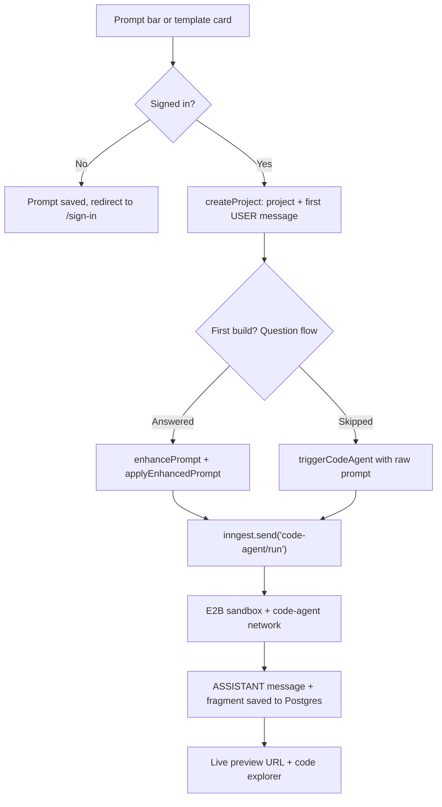
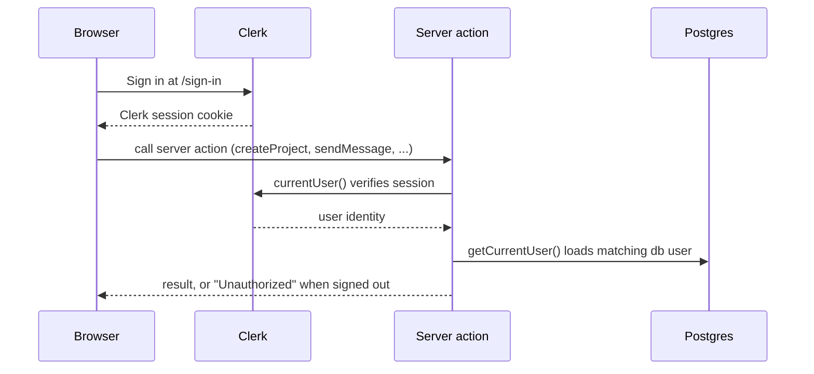
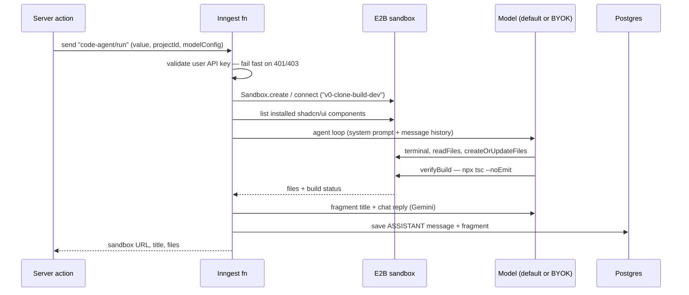

# v0-clone - [Link](v0-clone-jj.vercel.app)
A website which builds website.

https://github.com/user-attachments/assets/b3947d95-f9ad-4626-900f-cce2a85440d5

## Quickstart

```bash
pnpm install
cp .env.example .env          # the example ships names only — no real keys
pnpm run dev
```

`pnpm run dev` is `docker compose up -d v0-postgres && next dev`: it boots the bundled Postgres
container and starts the app on http://localhost:3000.

Against a fresh database, apply the checked-in migrations:

```bash
pnpm prisma migrate deploy
```

### Run with Docker

Local development never builds an image — the Dockerfile exists for actually shipping the app. It
produces the Next.js `standalone` output in a `node:22-alpine` runtime:

```bash
docker build -t v0-clone .
docker run --rm -p 3000:3000 -e DATABASE_URL=postgresql://... v0-clone
```

## Configuration

The default model is deliberately boring — GPT-4o Mini on the server's `OPENAI_API_KEY`, so a
first run costs zero setup. To change it, edit one file:

```ts
// lib/models.ts
export const DEFAULT_MODEL_ID = "gpt-4o-mini";
export const DEFAULT_PROVIDER: Provider = "openai";
```

Those two constants drive the model selector, the code agent, and the question flow. Everything
else in `MODELS` is the bring-your-own-key catalog (OpenAI, Anthropic, Google Gemini, xAI Grok):
pick one in the model selector, paste a key, and it travels with each build request.

## How it works

The build runs in three legs, and nothing past the prompt bar happens without auth or a project.



### Authentication

Clerk owns the session; every server action re-verifies it with `currentUser()` and throws
`Unauthorized` before touching the database, so there is no unauthenticated path into the build
pipeline. The root layout also upserts the Clerk user into the local `User` table on every visit.



### The AI build pipeline (Inngest + E2B)

`code-agent/run` is an Inngest function — see `inngest/function.ts`. It validates any user API
key, hooks into a persistent E2B sandbox, and turns an agent-kit agent loose with four tools:
`terminal`, `createOrUpdateFiles`, `readFiles`, and `verifyBuild` (a `npx tsc --noEmit` gate the
agent must pass before it calls the job done). The agent loops to a maximum of 10 iterations, and
a pair of lightweight Gemini agents write the chat reply and fragment title before the result is
saved.



## Project structure

```
├── app/                                  # Next.js App Router
│   ├── layout.tsx                        # Clerk, theme, query + tooltip providers
│   ├── (root)/
│   │   ├── page.tsx                      # home: prompt bar, templates, project list
│   │   └── pricing/page.tsx
│   ├── (auth)/
│   │   ├── sign-in/[[...sign-in]]/page.tsx
│   │   └── sign-up/[[...sign-up]]/page.tsx
│   ├── projects/
│   │   └── [projectId]/page.tsx          # chat + preview + code explorer
│   └── api/inngest/route.ts              # serves the code-agent function
├── inngest/
│   ├── client.ts                         # Inngest client
│   ├── function.ts                       # the entire code-agent build pipeline
│   └── utils.ts                          # last assistant text extraction
├── lib/
│   ├── db.ts                             # Prisma client (pg adapter, hot-reload safe)
│   ├── models.ts                         # MODELS catalog + DEFAULT_MODEL_ID
│   ├── agent-model.ts                    # resolves a model per provider/config
│   ├── provider-heartbeat.ts             # validates API keys before use
│   ├── usage.ts                          # credits + rate limiting
│   └── constant.ts                       # shared constants
├── modules/                              # feature modules
│   ├── home/                             # navbar, prompt form, project list
│   ├── projects/                         # project view, message flow, fragments, files
│   ├── messages/                         # sendMessage action + message hooks
│   ├── questions/                        # clarifying-question generation/enhancement
│   ├── model-select/                     # model config + provider keys (localStorage)
│   ├── auth/                             # Clerk onboarding + current-user lookup
│   ├── usage/                            # usage/credits UI
│   └── types/                            # shared payload types
├── components/
│   ├── ai-elements/                      # attachments, code-block, plan, sandbox, prompt-input…
│   └── ui/                               # shadcn/ui primitives
├── providers/                            # TanStack Query + theme providers
├── hooks/                                # use-mobile, use-scroll, use-current-theme
├── prisma/
│   ├── schema.prisma
│   └── migrations/
├── sandbox-templates/
│   ├── template.ts                       # definition of the E2B build sandbox
│   ├── build.dev.ts                      # builds the "v0-clone-build-dev" template
│   └── build.prod.ts
├── proxy.ts                              # Clerk middleware (Next 16 proxy file)
├── Dockerfile                            # multi-stage build → Node 22 standalone
└── docker-compose.yml                    # local Postgres for `pnpm run dev`
```

## License

MIT — see [LICENSE](LICENSE).

